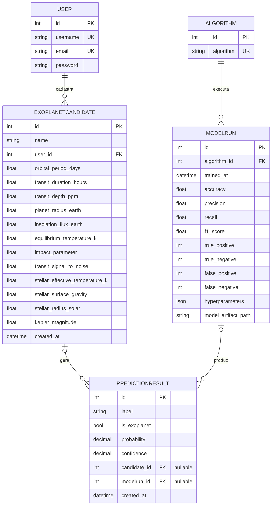

## Diagrama Entidade-Relacionamento

## Modelo Entidade-Relacionamento (MER) — Entidades e Atributos

### USER
Estende `AbstractUser` do Django (herda `username`, `password`, `is_staff`, etc.); `email` foi tornado único.

| Atributo | Tipo | Restrição |
|---|---|---|
| id | int | PK |
| username | string | UK |
| email | string | UK |
| password | string | — |

### EXOPLANETCANDIDATE
Candidato a exoplaneta cadastrado por um usuário, com as 12 variáveis KOI usadas pelo modelo.

| Atributo | Tipo | Restrição |
|---|---|---|
| id | int | PK |
| name | string | — |
| user_id | int | FK → USER |
| orbital_period_days | float | — |
| transit_duration_hours | float | — |
| transit_depth_ppm | float | — |
| planet_radius_earth | float | — |
| insolation_flux_earth | float | — |
| equilibrium_temperature_k | float | — |
| impact_parameter | float | — |
| transit_signal_to_noise | float | — |
| stellar_effective_temperature_k | float | — |
| stellar_surface_gravity | float | — |
| stellar_radius_solar | float | — |
| kepler_magnitude | float | — |
| created_at | datetime | auto_now_add |

### ALGORITHM
Catálogo de algoritmos de ML — no MVP, restrito a `random_forest`.

| Atributo | Tipo | Restrição |
|---|---|---|
| id | int | PK |
| algorithm | string | UK (choices) |

### MODELRUN
Execução e histórico de métricas de treinamento.

| Atributo | Tipo | Restrição |
|---|---|---|
| id | int | PK |
| algorithm_id | int | FK → ALGORITHM |
| trained_at | datetime | auto_now_add |
| accuracy | float | — |
| precision | float | — |
| recall | float | — |
| f1_score | float | — |
| true_positive | int | — |
| true_negative | int | — |
| false_positive | int | — |
| false_negative | int | — |
| hyperparameters | json | default={} |
| model_artifact_path | string | — |

### PREDICTIONRESULT
Resultado de predição, podendo vir de um candidato cadastrado ou de uma predição direta.

| Atributo | Tipo | Restrição |
|---|---|---|
| id | int | PK |
| label | string | choices: CONFIRMED / FALSE POSITIVE |
| is_exoplanet | bool | — |
| probability | decimal | — |
| confidence | decimal | — |
| candidate_id | int | FK → EXOPLANETCANDIDATE, nullable |
| modelrun_id | int | FK → MODELRUN, nullable |
| created_at | datetime | auto_now_add |

## Cardinalidade dos relacionamentos

| Relação | Cardinalidade | Regra de negócio / origem no código |
|---|---|---|
| USER → EXOPLANETCANDIDATE | 1:N, obrigatório | `user = ForeignKey(User, on_delete=CASCADE)` sem `null=True` — todo candidato pertence a exatamente um usuário |
| ALGORITHM → MODELRUN | 1:N, obrigatório | `algorithm = ForeignKey(Algorithm, on_delete=CASCADE)` sem `null=True` — todo `ModelRun` referencia exatamente um algoritmo |
| EXOPLANETCANDIDATE → PREDICTIONRESULT | 1:N, opcional | `candidate = ForeignKey(..., null=True, blank=True)` — permite predição direta sem candidato cadastrado |
| MODELRUN → PREDICTIONRESULT | 1:N, opcional | `modelrun = ForeignKey(..., on_delete=SET_NULL, null=True, blank=True)` — se o `ModelRun` for apagado, a predição permanece sem referência |

## Observações

- `Algorithm` funciona como tabela de catálogo: hoje trava em uma única linha (`random_forest`), mas o schema já suporta expansão para outros algoritmos sem alteração estrutural.
- `PredictionResult` é o único modelo com duas FKs opcionais, funcionando como nó de junção entre o pipeline de ML (`ModelRun`) e o uso da API (`ExoplanetCandidate`), refletindo os dois fluxos de predição descritos no README do projeto (via candidato cadastrado ou predição direta em JSON).